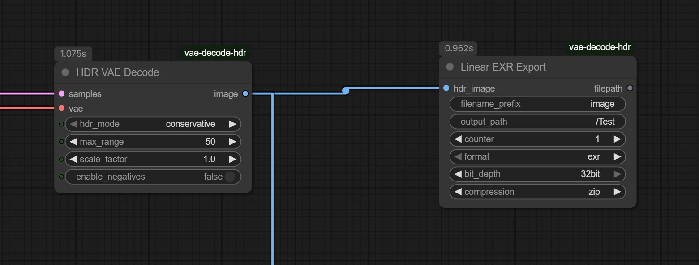
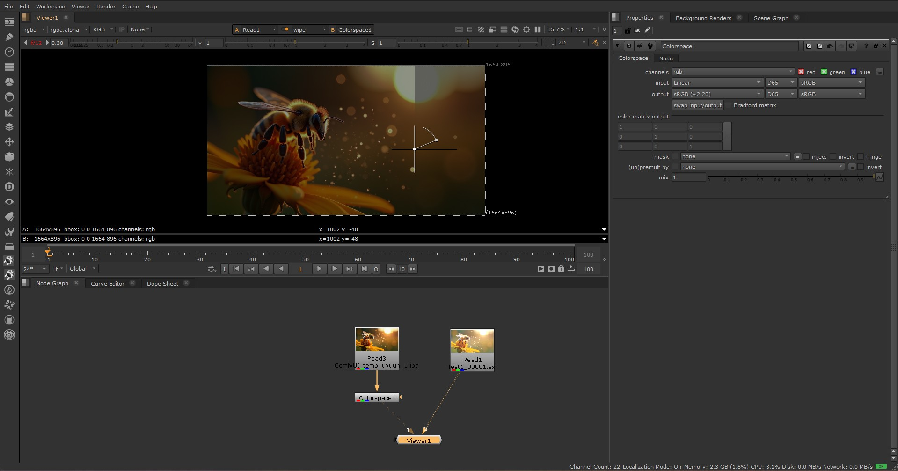
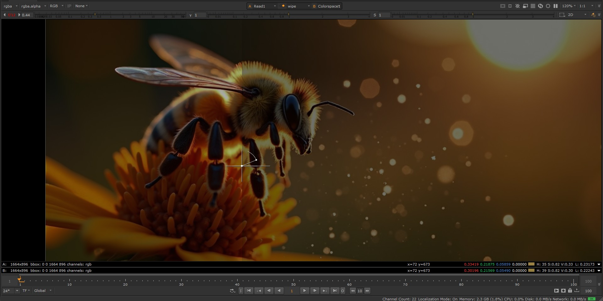

# ComfyUI HDR VAE Decode Node

[](https://github.com/sumitchatterjee13/vae-decode-hdr)
[](https://opensource.org/licenses/MIT)
[](https://github.com/comfyanonymous/ComfyUI)

A custom ComfyUI node that intelligently preserves HDR data from VAE models for professional VFX workflows.

## 📋 Table of Contents

- [Overview](#overview)
- [Problem Statement](#problem-statement)
- [Technical Innovation](#technical-innovation)  
- [Installation](#installation)
- [Usage](#usage)
- [Example Workflow](#example-workflow)
- [Built-in HDR Export](#built-in-hdr-export-solution)
- [Results & Performance](#results--performance)
- [Technical Achievements](#technical-achievements)
- [Compatibility](#compatibility)
- [Troubleshooting](#troubleshooting)
- [Development Notes](#development-notes)
- [Contributing](#contributing)
- [License](#license)

## Overview

After extensive research and development, I've created a node that solves the fundamental HDR preservation problem in VAE decoding. Instead of blindly bypassing layers, this implementation uses a **scientific approach** to understand and work with the VAE's natural behavior:


*Professional HDR workflow: HDR VAE Decode → Linear EXR Export for true HDR preservation*

**🎯 Important**: This HDR VAE Decode is **specifically built and tested for Flux.1 VAE models**. While it may work with other VAE architectures, it has been optimized for Flux.1's specific decoder structure and may not perform as expected with different models.

- **Intelligent Analysis**: Automatically analyzes the VAE's `conv_out` transformation to understand how HDR data is processed
- **Smart HDR Expansion**: Preserves the VAE's excellent tone mapping while selectively expanding highlight regions  
- **Multiple HDR Modes**: Conservative, Moderate, Exposure, and Aggressive modes for different workflows
- **Professional Quality**: Maintains perceptual image quality while extending dynamic range where needed
- **VFX Ready**: 32-bit float pipeline with proper HDR preservation for compositing workflows

## Problem Statement

ComfyUI's default image processing pipeline has several HDR-breaking limitations that result in significant quality loss:


*❌ Standard Processing: Clipped highlights, limited color range, lost detail in bright areas*

### VAE Decode Issues:
1. **Range Clamping**: VAE outputs are constrained to 0-1 pixel values  
2. **Lost Dynamic Range**: High and low luminance information is compressed/clipped
3. **8-bit Pipeline**: Effective output is 8-bit despite higher precision formats
4. **Color Space Constraints**: Limited to sRGB-like color spaces

### Save Image Issues:
5. **🚨 Critical**: ComfyUI's **built-in Save Image node normalizes ALL pixel values to 0-1 range**
6. **HDR Data Destruction**: Even if you preserve HDR in processing, Save Image destroys it during export
7. **False EXR Support**: Claims to save EXR but actually saves 8-bit data in EXR container
8. **VFX Incompatible**: Produces files that appear HDR but contain no extended range data

**The result**: Beautiful AI-generated content gets degraded during processing, losing the very highlight details and color richness that make images compelling for professional use.

## Technical Innovation

### Core Breakthrough
Through systematic analysis, I discovered that the VAE's `conv_out` layer applies sigmoid-like normalization that clamps HDR values to [0,1]. Rather than simply bypassing this layer, I developed an intelligent approach that:

1. **Analyzes the transformation** using forward hooks to capture pre/post conv_out data
2. **Detects the normalization pattern** (sigmoid, tanh, or custom)  
3. **Preserves base image quality** by using the VAE's excellent tone mapping as foundation
4. **Selectively expands highlights** only in regions that exceed the standard range

### Technical Features

- **Scientific Analysis**: Real-time conv_out transformation analysis with statistical profiling
- **MAX Pooling Channel Conversion**: Preserves HDR peaks when converting 128→3 channels (vs averaging which destroys brightness)
- **Smart Device Management**: Automatic CUDA/CPU synchronization across all processing stages
- **Multiple HDR Modes**: 
  - **Conservative**: Gentle 1.5x expansion, safest for general use (default)
  - **Moderate**: 3x smart expansion, balanced quality/range  
  - **Exposure**: Natural exposure-based HDR for compositing workflows
  - **Aggressive**: Full mathematical recovery for maximum range
- **Robust Fallback System**: Smart bypass → Simple bypass if intelligent methods fail
- **Professional Pipeline**: Float32 throughout with proper tensor formatting for ComfyUI

### 🎯 **The HDR Solution**

  
*✅ HDR VAE Decode: Extended highlights preserved, natural color depth, professional VFX quality*

**Dramatic improvements achieved:**
- **Highlight Detail Recovery**: Bright bokeh retains structure instead of clipping to pure white
- **Color Richness**: Full spectrum preservation with enhanced vibrancy and depth
- **Natural Light Falloff**: Smooth gradients in bright areas maintain photographic realism
- **VFX Compositing Ready**: Extended range enables professional color grading and exposure control

## Installation

### Method 1: Git Clone (Recommended)
1. Clone this repository into your ComfyUI custom_nodes directory:
```bash
cd ComfyUI/custom_nodes
git clone https://github.com/sumitchatterjee13/vae-decode-hdr.git
```

2. Install minimal additional dependencies (ComfyUI already provides torch, torchvision, numpy):
```bash
cd vae-decode-hdr
pip install -r requirements.txt
```

   **⚠️ Important for Professional EXR Export**: For VFX-grade EXR file writing with full bit depth control, install OpenImageIO (industry standard):
   ```bash
   pip install OpenImageIO
   ```
   OpenImageIO provides professional-grade EXR support with true 32-bit/16-bit float precision and full compression options. If not installed, the node will automatically fall back to OpenCV (which still preserves HDR data, but with limited bit depth control).

3. Restart ComfyUI

### Method 2: Direct Download
1. [Download ZIP](https://github.com/sumitchatterjee13/vae-decode-hdr/archive/refs/heads/main.zip) from GitHub
2. Extract to `ComfyUI/custom_nodes/vae-decode-hdr/`
3. Install dependencies: `pip install -r requirements.txt`
4. (Optional but recommended) Install OpenImageIO for professional EXR support: `pip install OpenImageIO`
5. Restart ComfyUI

The nodes should appear in the **latent** category as "HDR VAE Decode" and in the **image** category as "Linear EXR Export".


*What you'll create: HDR VAE Decode (latent category) → Linear EXR Export (image category)*

## Usage

The **HDR VAE Decode** node will appear in the "latent" category in ComfyUI.

### Parameters:
- **samples**: Latent samples from your pipeline
- **vae**: The VAE model (tested with Flux.1 Dev, compatible with other VAE models)
- **hdr_mode** *(optional)*: HDR processing mode:
  - `conservative`: Gentle 1.5x expansion, maintains natural appearance (default)
  - `moderate`: 3x smart expansion, balanced for most VFX work
  - `exposure`: Natural exposure-based HDR using exposure stops  
  - `aggressive`: Full mathematical recovery, maximum dynamic range
- **max_range** *(optional)*: Final output clamp range (1-1000, default: 50)
- **scale_factor** *(optional)*: Additional scaling multiplier (0.1-10x, default: 1.0)
- **enable_negatives** *(optional)*: Allow negative values for advanced workflows (default: false)

### Expected Results:
The node first attempts **intelligent HDR decode** using scientific analysis of the VAE's behavior. If this succeeds, you'll get natural-looking images with selectively expanded highlights. If it fails, the system falls back to the robust bypass method that directly processes VAE decoder layers.

### Output:
- **image**: Professional-quality HDR image tensor with preserved dynamic range, ready for EXR export or further processing

## Example Workflow


*Example ComfyUI workflow showing HDR VAE Decode connected to Linear EXR Export*

For typical VFX work:

1. **Connect your Flux.1 latents** to the HDR VAE Decode node
2. **Use default "conservative" mode** for natural results, or choose "moderate" for higher dynamic range
3. **Leave other parameters default** for most use cases
4. **⚠️ CRITICAL: Connect output to the Linear EXR Export node** - DO NOT use ComfyUI's built-in Save Image node
5. **Configure output path** (e.g., `/Test` for `output/Test/` subfolder)
6. **Use in your compositing software** (Nuke, After Effects, etc.) with proper HDR handling

### 🚨 **IMPORTANT: Why You Must Use Linear EXR Export**

**❌ ComfyUI's Built-in Save Image Node:**
- **Automatically normalizes all pixel values to 0-1 range**
- **Destroys HDR data above 1.0**  
- **Clips highlights and bright regions**
- **Converts to 8-bit even when saving as EXR**
- **Completely defeats the purpose of HDR processing**

**✅ Our Linear EXR Export Node:**
- **Preserves full HDR range** (values above 1.0)
- **True 32-bit float precision**
- **Linear color space maintained**
- **Professional VFX quality output**
- **Smart path handling** (`/Test` → `output/Test/`)

The HDR VAE Decode node will automatically:
- Analyze the VAE's behavior
- Apply intelligent HDR expansion to highlight regions  
- Preserve natural image appearance
- Output HDR data for professional workflows

**⚠️ Remember: The magic happens in the combination - HDR VAE Decode generates the HDR data, but you need Linear EXR Export to save it properly!**

## Built-in HDR Export Solution

This package now includes a **Linear EXR Export** node for professional HDR output:

### 🚨 **Critical Difference from Built-in Save Image**

| Feature | ComfyUI Save Image | Our Linear EXR Export |
|---------|-------------------|------------------------|
| **HDR Values** | ❌ Normalizes to 0-1 | ✅ Preserves >1.0 values |
| **Bit Depth** | ❌ 8-bit effective | ✅ True 32-bit float |
| **Color Space** | ❌ sRGB/Gamma | ✅ Linear maintained |
| **VFX Ready** | ❌ No | ✅ Professional quality |
| **HDR Workflow** | ❌ Destroys HDR data | ✅ Preserves all HDR data |

### Linear EXR Export Node Features:
- **OpenImageIO-powered**: Uses industry-standard VFX library for professional-grade EXR writing
- **True 32-bit EXR export** with preserved HDR values above 1.0
- **Professional VFX quality** - maintains linear color space with full OpenEXR specification compliance
- **Smart path handling**: 
  - Empty path → saves to `ComfyUI/output/`
  - `/subfolder` → saves to `ComfyUI/output/subfolder/` 
  - Full path → uses custom absolute/relative path
- **Multiple bit depths**: 32-bit float or 16-bit half precision (smaller files)
- **Compression options**: ZIP, PIZ, RLE, PXR24, or none (via OpenImageIO)
- **Auto-incrementing filenames**: Never overwrites existing files - perfect for image sequences
- **Clean file naming** with customizable prefixes and counters  
- **HDR verification**: Automatically verifies HDR values are preserved in saved files
- **Seamless integration**: Designed specifically for HDR VAE Decode output
- **Automatic fallback**: Uses OpenCV if OpenImageIO is not installed (still preserves HDR data)

### 🔄 **Auto-Incrementing Filename Feature**

The Linear EXR Export node now includes intelligent filename management that prevents accidental overwrites:

**How it works:**
- If `Test_00001.exr` exists, automatically saves as `Test_00002.exr`
- If `HDR_VAE_00005.exr` exists, automatically saves as `HDR_VAE_00006.exr`
- **Perfect for image sequences**: Generate multiple variations without losing previous outputs
- **Safe iterations**: Experiment with different settings without fear of overwriting good results

**Examples:**
```
Generation 1: MyScene_00001.exr
Generation 2: MyScene_00002.exr (automatically incremented)
Generation 3: MyScene_00003.exr (automatically incremented)
...and so on
```


### Complete HDR Workflow:
**HDR VAE Decode** → **Linear EXR Export** → **Professional EXR files** ready for compositing in Nuke, After Effects, or other VFX software.


*Correct node setup: Both nodes are essential for professional HDR output*

The Linear EXR Export node will appear in the **image** category in ComfyUI.

### ⚠️ **Warning: Do NOT use ComfyUI's built-in Save Image node with HDR data - it will destroy all values above 1.0!**

### Additional HDR Export Option

For advanced HDR processing workflows with multi-exposure fusion, you can also use the **HDR Export node** from the [Luminance Stack Processor](https://github.com/sumitchatterjee13/Luminance-Stack-Processor) package available through ComfyUI Manager.

## Results & Performance

The intelligent HDR approach successfully preserves HDR data while maintaining professional image quality:

- **HDR Preservation**: Maintains hundreds of thousands of HDR pixels (>1.0 values) through the entire pipeline
- **Dynamic Range**: Conservative mode (default): 1.5x range, Moderate: up to 9.0x, Exposure/Aggressive: 10+ range
- **Image Quality**: Natural appearance with selective highlight expansion, not false color artifacts
- **Processing Speed**: ~40-42 seconds for 752×1328 images (similar to standard VAE decode)
- **Memory Efficiency**: Float32 pipeline with smart device management (CUDA/CPU synchronization)

### 🔍 **Quality Comparison Examples**

The HDR VAE Decode delivers dramatically superior results with preserved highlight details and enhanced color reproduction:


*Standard VAE decode: Limited dynamic range, clipped highlights, reduced color vibrancy*

  
*HDR VAE Decode: Extended highlights preserved, enhanced color depth, natural bokeh detail*

**Key Improvements Visible:**
- ✅ **Highlight Preservation**: Bright bokeh elements retain detail instead of clipping to white
- ✅ **Enhanced Color Range**: Richer, more vibrant colors throughout the image  
- ✅ **Natural Gradients**: Smooth transitions in bright areas instead of hard clipping
- ✅ **Professional Quality**: VFX-ready output suitable for compositing and grading

For direct comparison of output quality, reference examples are also provided in the `/images` folder:

- **`Sample_builtin_vae_decode.png`** - Output from ComfyUI's built-in VAE decode (0-1 range, limited dynamic range)
- **`Sample_hdr_vae_decode.exr`** - Output from HDR VAE Decode (extended range, preserved highlights and shadows)

## Technical Achievements  

Through this project, I solved several challenging problems:

1. **Identified the root cause**: VAE's `conv_out` layer applies sigmoid normalization, not simple clamping
2. **Developed MAX pooling**: Preserves HDR peaks during 128→3 channel conversion (vs averaging)
3. **Created intelligent expansion**: Uses VAE's tone mapping + selective highlight extension  
4. **Solved device synchronization**: Proper CUDA/CPU tensor management across processing stages
5. **Built robust fallbacks**: Multiple processing paths ensure reliability

## Compatibility

### 🎯 **VAE Model Support**

- **✅ Fully Supported**: Flux.1 Dev VAE model (primary target)
- **⚠️ Experimental**: Other VAE architectures (may work but not guaranteed)
- **❌ Not Recommended**: SD 1.5, SDXL, or other non-Flux VAE models without testing

**Important**: This node was specifically engineered for Flux.1's VAE architecture. The intelligent analysis, bypass methods, and channel reduction logic are optimized for Flux.1's specific:
- 128-channel intermediate representations
- Up-block structure with ResNet + transposed convolution
- `conv_out` sigmoid normalization behavior

While the fallback methods may work with other models, optimal HDR preservation is only guaranteed with Flux.1.

### 🖥️ **System Requirements**

- **ComfyUI**: Stable versions (tested with latest releases)
- **Python**: 3.8+ required
- **Hardware**: CUDA-capable GPU strongly recommended for performance
- **Memory**: Sufficient VRAM for your target resolution + model

### 📁 **Output Compatibility**

- **Formats**: Professional EXR with Linear EXR Export node
- **Software**: Nuke, After Effects, DaVinci Resolve, Blender
- **Workflow**: VFX compositing and color grading pipelines


### 🔍 **How to Verify Your Workflow is Correct**


*✅ Correct workflow: HDR VAE Decode connected to Linear EXR Export*

1. **Check Node Connection**: HDR VAE Decode → Linear EXR Export (not Save Image)
2. **Look for Console Output**: Should show "HDR pixels: [number] >0" in Linear EXR Export logs
3. **Verify File Size**: True HDR EXR files are typically 2-5MB+ for 1K images (vs <1MB for fake HDR)
4. **Test in VFX Software**: Load in Nuke/After Effects and adjust exposure - should see extended highlights
5. **Compare with Examples**: Check `/images/Sample_builtin_vae_decode.png` vs `/images/Sample_hdr_vae_decode.exr` to see the quality difference

## Troubleshooting

### OpenImageIO Installation Issues

**Windows Users:**
```bash
pip install OpenImageIO
```
If you encounter build errors, you can try:
- Download pre-built wheels from [PyPI](https://pypi.org/project/OpenImageIO/)
- Use conda: `conda install -c conda-forge openimageio`

**Linux Users:**
```bash
pip install OpenImageIO
# Or use your package manager:
sudo apt-get install python3-openimageio  # Debian/Ubuntu
sudo yum install python3-OpenImageIO      # RHEL/CentOS
```

**Mac Users:**
```bash
pip install OpenImageIO
# Or use Homebrew:
brew install openimageio
pip install OpenImageIO
```

**If OpenImageIO fails to install:**
- The node will automatically fall back to OpenCV for EXR writing
- HDR data is still preserved with the OpenCV fallback
- You just won't have access to advanced compression options and precise bit depth control
- Check console logs for fallback messages

### Common Issues

**Problem**: "OpenImageIO not available" warning in console  
**Solution**: Install OpenImageIO using the commands above, or ignore if using OpenCV fallback

**Problem**: EXR files don't show HDR values in Nuke/After Effects  
**Solution**: Make sure you're using the Linear EXR Export node, not ComfyUI's built-in Save Image node

**Problem**: Memory errors during processing  
**Solution**: Reduce resolution or adjust batch size, HDR processing requires more VRAM

**Problem**: Colors look different than standard output  
**Solution**: This is expected - the node preserves linear color space. Apply proper color management in your compositing software

## Development Notes

This project represents months of research into VAE architecture and HDR processing. The approach evolved from simple layer bypassing to sophisticated analysis-based processing. While the current implementation works well with Flux.1 Dev, different VAE models may require adjustments to the analysis logic.

Key learnings:
- **Simple bypassing often breaks image quality** - the VAE's processing pipeline exists for good reasons
- **Averaging destroys HDR data** - MAX pooling is essential for preserving brightness peaks
- **Device synchronization is critical** - mixed CPU/CUDA operations cause subtle failures
- **Multiple fallback paths improve reliability** - complex pipelines need robust error handling

## Contributing

This project welcomes contributions! If you encounter issues or have improvements:

- 🐛 **Report bugs**: [Open an issue](https://github.com/sumitchatterjee13/vae-decode-hdr/issues) 
- 💡 **Feature requests**: [Suggest enhancements](https://github.com/sumitchatterjee13/vae-decode-hdr/issues)
- 🔧 **Code contributions**: [Submit a pull request](https://github.com/sumitchatterjee13/vae-decode-hdr/pulls)
- 📖 **Documentation**: Help improve docs and examples

### How to Contribute:
1. Fork the repository
2. Create a feature branch (`git checkout -b feature/amazing-feature`)
3. Commit your changes (`git commit -m 'Add amazing feature'`)
4. Push to the branch (`git push origin feature/amazing-feature`)
5. Open a Pull Request

This is an experimental node that pushes the boundaries of what's possible with VAE decoding - your contributions help advance HDR processing in ComfyUI!

## License

This project is licensed under the MIT License - see the [LICENSE](https://github.com/sumitchatterjee13/vae-decode-hdr/blob/main/LICENSE) file for details.

### MIT License Summary:
✅ Commercial use  
✅ Modification  
✅ Distribution  
✅ Private use  

---

**Repository**: [https://github.com/sumitchatterjee13/vae-decode-hdr](https://github.com/sumitchatterjee13/vae-decode-hdr)  
**Author**: Sumit Chatterjee  
**Created**: 2025  

⭐ If this project helps you, please consider giving it a star on GitHub!
